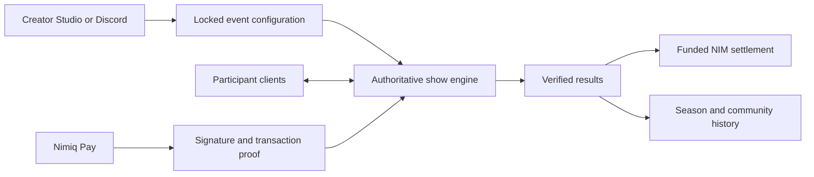

<p align="center">
  
</p>

<h1 align="center">Live community play, powered by Nimiq</h1>

<p align="center">
  Mimo creates and runs live games, votes and skill challenges for communities, then turns verified results into trustworthy NIM rewards.
</p>

<p align="center">
  <a href="https://playmimo.xyz"><strong>Open Mimo</strong></a>
  ·
  <a href="docs/NIMIQ_PAY_PHONE_TEST.md">Phone test guide</a>
  ·
  <a href="SECURITY.md">Security</a>
</p>

## Why Mimo exists

Communities already gather for game nights, launches, onboarding and decisions. Running those moments usually means combining a meeting, a form, a chat bot, a spreadsheet and manual wallet transfers.

Mimo makes the whole experience one live show. The creator brings the community; Mimo drafts the content, welcomes the room, keeps every screen synchronized, scores declared rules on the server and handles verified NIM settlement.

This is not a quiz with a payment button. It is participatory community entertainment designed to give people a reason to return.

## The experience

1. **Create** — Start manually or ask Mimo to draft an editable event from a brief.
2. **Publish** — Choose public or private access, individual or team play, timing and a funded NIM reward when the event calls for one.
3. **Join** — Participants enter from a link, QR code, community page or Discord. Free rooms remain wallet-optional.
4. **Play** — Mimo runs polls, objective questions and collective moments while the server owns time, answers and scores.
5. **Prove** — Rewarded or protected rooms use a short-lived Nimiq Pay signature to verify one wallet without moving money.
6. **Drop** — Locked results trigger the declared payout path. Every funding, payout and refund state follows real chain evidence.
7. **Return** — Community seasons, standings, follows, notifications and fresh event editions make the next gathering easy.

## What is live

| Product area | Current capability |
| --- | --- |
| Live rooms | Server-authoritative lifecycle, deadlines, scoring, reactions, teams and reconnect recovery |
| Creation | Manual editor, preview, rehearsal and Gemini-assisted editable drafts |
| Formats | Game nights, community votes, product launches, onboarding and open-format events |
| Access | Public rooms, invite-only rooms and independently configurable wallet verification |
| Nimiq Pay | Account access, one-use signatures, native payment approval and honest cancellation/failure states |
| NIM rewards | Mainnet vault funding, automatic skill payouts, Community Unlocks, refunds and transaction proof |
| Communities | Public homes, pictures, roles, follows, notifications, recurring schedules, seasons and standings |
| Discord | OAuth connection, minimal-permission install, channel verification, admin-only creation, private draft handoff, event invitations and season points |
| Operations | Privacy-conscious real/QA classification, event recaps and a protected competition report |

Discord is in production beta until the full real-server acceptance checklist passes. X creation and distribution remain intentionally outside the critical product path.

## Why Nimiq matters

Nimiq is part of Mimo's trust model, not decoration.

- **Wallet-backed identity:** Nimiq Pay signs a one-use room challenge. No payment happens during verification.
- **Lightweight abuse protection:** the server verifies the signature and address, blocks replay and limits one verified wallet per event.
- **Protected recipients:** payout addresses are encrypted at rest and become immutable when play begins.
- **Provable funding:** Mimo calls a reward funded only after verifying the transaction, recipient, amount, network and room memo.
- **Automatic settlement:** a genuinely pre-funded vault can pay verified winners according to rules approved before launch.
- **Honest recovery:** cancelled funded lobbies can be refunded to the verified payer, including Nimiq Pay payments routed through HTLC transactions.
- **Self-custody at approval:** sensitive account, signature and payment requests remain inside native Nimiq Pay confirmation dialogs.

Mimo never asks for a participant's seed phrase or wallet private key. AI cannot publish an event, change launched scoring rules, select a subjective winner or authorize funds.

## System design



- **Frontend:** TypeScript, React, Next.js 16, Tailwind CSS, accessible primitives and Motion
- **Backend:** Vercel Functions with server-owned room orchestration
- **Data:** Turso managed SQLite and Vercel Blob community images
- **Nimiq:** `@nimiq/mini-app-sdk` for native requests and `@nimiq/core` for verification
- **Reliability:** immutable launch snapshots, idempotent actions, replay protection, bounded polling and reconnect restoration

Clients submit intent, never scores, eligibility or payment status. The server is authoritative for the room lifecycle, deadlines, accepted answers, score calculation and final result.

## Discord flow

Community owners connect one server and choose a channel in Mimo Studio. Mimo verifies that it can post before saving the connection.

- `/mimo create` is restricted to the connected community's wallet-authorized owners and admins.
- The command returns privately and sends a ten-minute, one-use creation handoff by DM.
- Opening the handoff restores the already-linked Mimo profile in that browser and starts the editable AI draft.
- Discord cannot publish an event, change its rules or authorize NIM.
- Free events are announced when published. Rewarded events are announced only after funding is confirmed.
- The invitation becomes a results recap after completion and updates again when NIM settlement is confirmed.
- `/mimo points` returns the member's wallet-backed season standing privately.

Mimo requests only identity, manageable-server discovery, View Channel, Send Messages, Embed Links and application-command access. It does not request message history, member management, moderation or Administrator.

## Run locally

Requirements: Node.js 24 and npm.

```bash
git clone https://github.com/playmimoapp/mimo.git
cd mimo
npm install
cp .env.example .env.local
npm run db:migrate
npm run dev
```

The default local database is SQLite. Gemini, Turso, Blob, Discord and real NIM settlement are optional server integrations and remain unavailable until their environment variables are configured. Mainnet custody fails closed unless every required production control is present.

Never place Gemini, Discord, database or vault secrets in browser-visible variables.

## Verify a change

```bash
npm run lint
npm run build
npm run test:room -- http://localhost:3000
npm run test:community -- http://localhost:3000
npm run test:identity -- http://localhost:3000
npm run test:wallet-entry -- http://localhost:3000
```

Automated simulations are engineering checks, not proof of real users or payments. Native dialogs, wallet cancellation, mainnet settlement and responsive layout must also pass the [physical Nimiq Pay checklist](docs/NIMIQ_PAY_PHONE_TEST.md).

## Privacy and safety

- Full wallet addresses are not exposed in public room data.
- Wallet and Discord identifiers are stored as scoped hashes where raw identity is unnecessary.
- Payout and refund addresses are encrypted at rest.
- Public rooms may be free and anonymous; wallet proof is requested only when the event requires it.
- Random winner rewards, gambling, pay-to-win scoring and unrestricted chat are not supported.
- Payment cancellation is a normal recoverable state, never presented as an application crash.

This is lightweight Sybil resistance, not a claim of perfect personhood.

## Project status

Mimo is a live product under active competition testing. The remaining release work is operational: complete the Discord real-server acceptance pass, finish physical-device QA, run multiple genuine community events with more than 25 wallet-connected users and publish the resulting privacy-safe evidence.

See [CONTRIBUTING.md](CONTRIBUTING.md) before proposing a change. Report sensitive findings privately using [SECURITY.md](SECURITY.md).

## Licence

Mimo is open source under the [MIT Licence](LICENSE).
